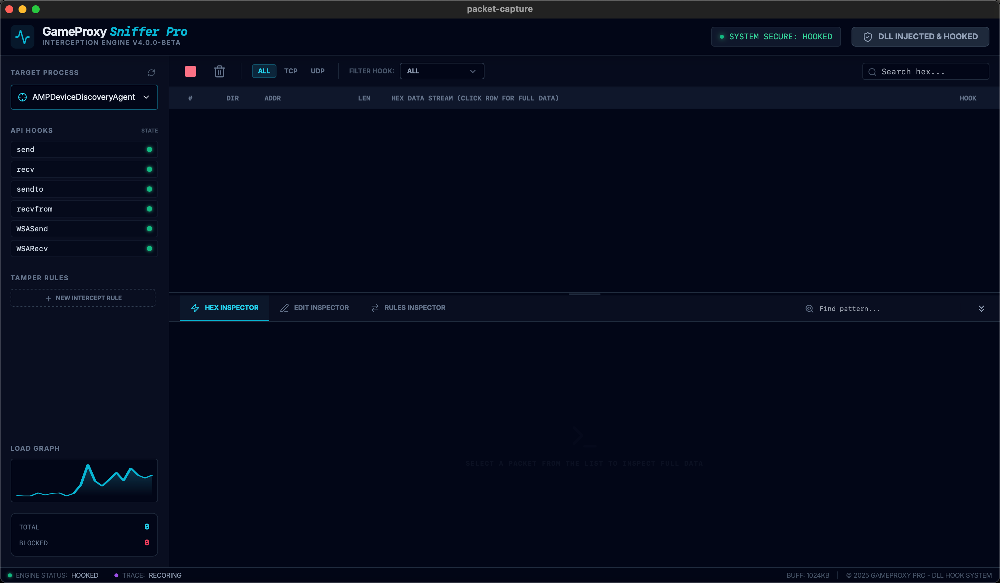

# Packet Capture - 网络数据包捕获工具

一个基于 Windows 平台的网络数据包捕获和分析工具，通过 DLL 注入和 API Hook 技术实时拦截和监控应用程序的网络通信。



## ✨ 功能特性

### 核心功能
- 🔍 **网络流量拦截**：通过 DLL 注入和 API Hook 技术拦截目标进程的网络通信
- 📦 **数据包捕获**：实时捕获 TCP、UDP、HTTP、HTTPS 等协议的数据包
- 📊 **数据解析与展示**：解析并可视化展示捕获的数据包内容
- 🔎 **过滤与搜索**：支持按协议、域名、关键词等条件过滤和搜索
- 📤 **导出功能**：支持将捕获的数据导出为多种格式（JSON、HAR、PCAP 等）
- 🎮 **游戏代理嗅探**：专门针对游戏网络通信的代理嗅探功能
- ⚙️ **数据包篡改**：支持配置篡改规则，实时修改或拦截数据包

### 支持的 Hook 类型
- `send` / `recv` - 基础 Socket 发送/接收
- `sendto` / `recvfrom` - UDP Socket 发送/接收
- `WSASend` / `WSARecv` - Windows Socket API 发送/接收
- `WSASendTo` / `WSARecvFrom` - Windows Socket API UDP 发送/接收

## 🛠️ 技术栈

### 前端
- **React 19** - UI 框架
- **TypeScript** - 类型安全
- **Vite** - 构建工具
- **Ant Design 6** - UI 组件库
- **Tailwind CSS 4** - 样式框架
- **React Window** - 虚拟滚动优化

### 后端
- **Tauri 2.0** - 桌面应用框架
- **Rust** - 系统编程语言
- **IPMB** - 进程间消息总线通信
- **MinHook-RS** - Windows API Hook 库

### Hook DLL
- **Rust DLL** - 注入到目标进程的 DLL
- **Windows API Hook** - 拦截网络函数调用
- **进程注入** - 将 DLL 注入到目标进程

## 📋 系统要求

- **操作系统**：Windows 10/11 (64位)
- **Node.js**：v18 或更高版本
- **Rust**：最新稳定版
- **权限**：需要管理员权限（用于 DLL 注入）

## 🚀 快速开始

### 安装依赖

```bash
# 安装 Node.js 依赖
pnpm install

# 安装 Rust 依赖（自动通过 Cargo 管理）
```

### 开发模式

```bash
# 启动开发服务器
pnpm dev

# 或使用 Tauri 开发模式
pnpm tauri dev
```

### 构建应用

```bash
# 构建前端
pnpm build

# 构建 Tauri 应用
pnpm tauri build
```

## 📁 项目结构

```
packet-capture/
├── src/                    # React 前端源码
│   ├── App.tsx            # 主应用组件
│   └── main.tsx           # 入口文件
├── src-tauri/             # Tauri 后端源码
│   ├── src/
│   │   ├── main.rs        # Tauri 主程序
│   │   └── lib.rs         # 核心逻辑（IPMB 通信、命令处理）
│   └── Cargo.toml         # Rust 依赖配置
├── hook-dll/              # Hook DLL 源码
│   ├── src/
│   │   ├── lib.rs         # DLL 入口和导出函数
│   │   ├── network_hook.rs # 网络 Hook 实现
│   │   └── wildcard.rs    # 通配符匹配
│   └── examples/          # 示例代码
├── GameProxySnifferPro/   # 游戏代理嗅探模块
│   ├── App.tsx            # 游戏代理 UI
│   ├── api.ts             # API 接口
│   └── types.ts           # 类型定义
└── package.json           # Node.js 依赖配置
```

## 🔧 使用说明

### 基本使用流程

1. **启动应用**：运行 `pnpm tauri dev` 启动应用
2. **选择目标进程**：在进程列表中选择要监控的应用程序
3. **注入 DLL**：点击"注入"按钮将 Hook DLL 注入到目标进程
4. **开始抓包**：点击"开始抓包"按钮开始捕获网络数据包
5. **查看数据**：在数据包列表中查看捕获的网络通信
6. **过滤搜索**：使用过滤器和搜索功能查找特定数据包
7. **导出数据**：将捕获的数据导出为所需格式

### 数据包篡改规则

支持配置篡改规则来实时修改或拦截数据包：

- **匹配规则**：使用通配符或正则表达式匹配数据包特征
- **替换操作**：将匹配的数据包内容替换为指定内容
- **拦截操作**：直接拦截匹配的数据包，阻止其发送/接收
- **Hook 类型**：指定规则应用的 Hook 类型（send/recv/WSASend 等）

## 🏗️ 架构设计

### 通信流程

```
目标进程 (被 Hook)
    ↓ (DLL 注入)
Hook DLL (hook-dll)
    ↓ (IPMB 消息)
Tauri 后端 (src-tauri)
    ↓ (Tauri IPC)
React 前端 (src)
```

### IPMB 通信

- **命令通道** (`com.solar.command`)：Tauri → Hook DLL
  - 发送 Hook 控制命令（启用/禁用特定 Hook）
  - 发送篡改规则配置

- **数据通道** (`com.solar.capture`)：Hook DLL → Tauri
  - 接收捕获的数据包
  - 实时推送到前端显示

## 📝 开发指南

### 添加新的 Hook 类型

1. 在 `hook-dll/src/network_hook.rs` 中添加新的 Hook 函数
2. 在 `src-tauri/src/lib.rs` 中添加对应的命令处理
3. 在前端 `GameProxySnifferPro/types.ts` 中添加类型定义

### 调试技巧

- **Hook DLL 调试**：使用 `env_logger` 输出日志，查看 DLL 注入和 Hook 执行情况
- **IPMB 通信调试**：在 Tauri 和 DLL 中打印 IPMB 消息，检查通信是否正常
- **前端调试**：使用 React DevTools 和浏览器开发者工具

## ⚠️ 注意事项

1. **管理员权限**：DLL 注入需要管理员权限，请以管理员身份运行应用
2. **杀毒软件**：某些杀毒软件可能会拦截 DLL 注入行为，需要添加白名单
3. **进程保护**：部分受保护进程（如系统进程）可能无法注入
4. **性能影响**：Hook 操作会对目标进程性能产生一定影响，建议在测试环境使用

## 📄 许可证

本项目采用 MIT 许可证。

## 🤝 贡献

欢迎提交 Issue 和 Pull Request！

## 📚 相关文档

- [设计文档](./DESIGN.md) - 详细的设计文档
- [前端设计文档](./FRONTEND_DESIGN.md) - 前端 UI/UX 设计文档
- [Tauri 文档](https://tauri.app/) - Tauri 框架官方文档
- [Rust 文档](https://doc.rust-lang.org/) - Rust 语言官方文档

## 🔗 相关链接

- [Tauri](https://tauri.app/)
- [React](https://react.dev/)
- [Ant Design](https://ant.design/)
- [IPMB](https://crates.io/crates/ipmb)
